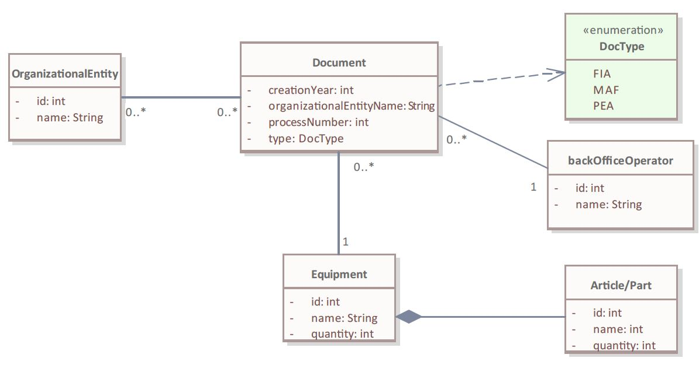
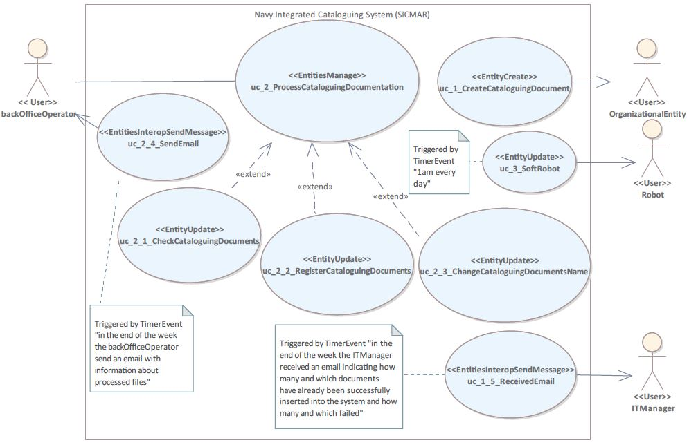
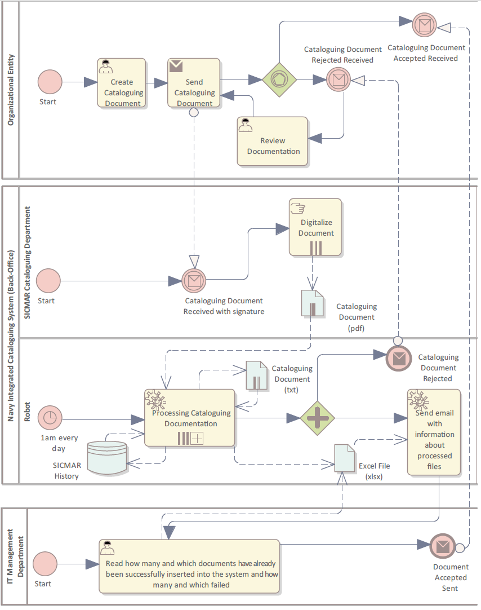
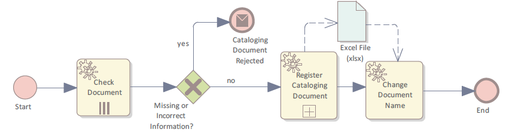
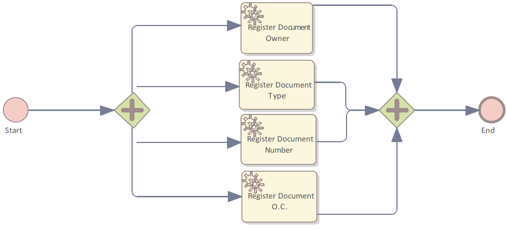

# Platform-Independent Specifications for Robotic Process Automation Applications

## Specification

### Spec. 1: Partial specification of a use case scenario 

WITH A VERBOSE WRITING STYLE (CNL-B) 
>Use Case' Scenarios:
>
>UseCase uc_1_ManageInvoices
>
>[...]
>
>0. Scenario MainScenario (Main):
>
>1. System: Shows a list of Invoices and available actions, namely CreateInvoice, UpdateInvoice, ConfirmPayment, SendInvoices, and PrintInvoice. In addition, there >are actions to Close the interaction space, Select/Unselect Invoices, Search Invoices, and Filter Invoices.
>
>2. Actor: Browses the list of Invoices and consult Invoices
>
>3. Actor: Selects the option Close.

### Spec. 2: Example of source code written in Python 

def: fizzbuzz(n):

  if not isinstance(n, int):
  
    raise TypeError(‘n is not an integer’)
    
  if n % 3 == 0:
  
    return ‘fizzbuzz’ if n % 5 == 0 else ‘fizz’
    
  elif n % 5 == 0:
  
    return ‘buzz’
    
  else:
  
    return str(n)

### Spec. 3: Example of corresponding pseudocode written in English (Spec. 2) 

Define the function fizzbuzz with an argument n.

  if n is not an integer value,
  
    throw a TypeError exception with a message …
    
  if n is divisible by 3,
  
    if n is divisible by 5
    
      return 'fizzbuzz'
      
    else
    
      'fizz'
      
  else if n is divisible by 5,
  
    return the string 'buzz'.
    
  otherwise,
  
    return the string representation of n. 

### Spec. 4: Robot Framework – example of tables written in plain text. 

#### *** Settings ***

Library           ExcelLibrary

#### *** Variables ***

@{count1}

${Count}          ${EMPTY}

${VAR1}           ${EMPTY}

#### *** Test Cases ***

ExcelTC01

    Open Excel    C:/RP/DemoProject/Demo.xls
    
    Put Number To Cell    sample123    1    0    10
    
    Save Excel    Demo2.xls

### Spec. 6: Specification-based on Use Cases (uc_3_SoftRobot)

DataEntities: 

>
>DataEntity e_backOfficeOperator is a Master […].  
>
>DataEntity e_organizationalEntity is a Master […].  
>
>DataEntity e_document is a Document […].  

Actors: 

>Actor a_backOfficeOperator (Operator) is a User who Process documents. 
>
>Actor a_OrganizationalEntity (Customer) is a User, who creates documents. 
>
>Actor, a_Robot (Robot), is the robot responsible for robotic process automation. 
>

Use Cases: 

>UseCase uc_3_SoftRobot is a EntitiesManage with e_document, actor_a_Robot. 

### Spec. 7: Specification-based on Use Cases Scenarios.

Use Cases Scenarios: 

UseCase uc_3_SoftRobot 
[…] 
>s0. Scenario MainScenario (Main): 
>
>s1. Robot: Get from a specific location folder the list of digitalized documents (in a “pdf” format), with file names outside the standard format. 
>
>s2. Robot: Read and convert each document from “pdf” into “txt” format, using OCR technology with a scale of zero. 
>
>s3. Robot: Browses the list of Documents and opens each one of them in “txt” format. 
>
>s4. Robot: For each document, extract and insert in an excel file the following text fragments: document type, organizational entity (responsible for document  >creation), process number and creation year.  
>
>s5. Robot: In addiction, insert into the excel file the path where the document is located. 
>
>s6. Robot: Get the document filename in the correct standard format from the Excel file and change the filename of each one. 
>
>s7. Robot: If the document filename is in the correct format then upload the file into the data store of the SICMAR application and move it to the Processed Document >Folder.  
>
>s8. Robot: In case the document file has an incorrect format filename then move it to the Failed Document Folder. 
>
>s9. Robot: Send an email message to the IT Manager specifying how many and which documents have already been successfully inserted into the system and how many and >which have failed. 

### Spec. 8: Specification based on Pseudocode

Soft Robot SICMAR: 

//1st: declaration of variables 
>
> pdfPath = Environment.CurrentDirectory  
>
>  pdfFiles = Directory.GetFiles(pdfPath,"*.pdf") 
>
>  totalNumberOfPdfFiles = 0   
>
>  numberOfFinishedPdfFiles = 0  
>
>  numberOfFailedPdfFiles = 0  
>
>  extratedText, strtype, strNumber, strEntity, strCreationYear, strOC, newPdfFileName, oldPdfFileName 
>
//2nd: read and convert document file from “pdf” //into “txt” format 
>
>begin 
>
>  FOR each pdfFile In pdfFiles 
>
>   […] 
>
>    READ pdfFile with OmniPage OCR (SCALE(0)) 
>
>    WRITE extractedText  	  	 
>
>  END IF   
>
//3rd: replace wrong format information in the //document file 
>
>ExtratecdText = strText.Replace("Nº:","Number:") 
>
>ExtratecdText = strText.Replace("From.","From:") 
>
>ExtratecdText = strText.Replace("'","") 
>
//4th: extract information from the document file //using regular expressions 
>
>IF String.IsNullOrEmpty(strCreationYear) 
>
>  StrCreationYear = System.Text.RegularExpressions.Regex.Match(strText,"(?i)(?<=Data:\s)(\d{2}.\d{2}.\d{4})").Value 
>
>END IF 
>
//5th: write extracted information from the //document file in the excel file 
>
>   WRITE strType  	       
>
>    WRITE strEntity  	       
>
>    WRITE strProcessNumber      
>
>    WRITE strCreationYear  	 
>
//6th: read new document filename in the excel  //file  
>
>    READ 	newPdfFileName 
>
>  IF cell.Length < 17 OR cell.Length > 19 OR cell.Contains("/") OR String.IsNullOrEmpty(cell) 
>
//7th: change document filename and move it to a //specific folder  
>
>   MOVE pdfFile INTO FailedPdfsFolder 
>
>      numberOfFailedPdfFiles = numberOfFailedPdfFiles + 1 
>
>      totalNumberOfPdfFiles = totalNumberOfPdfFiles+1 
>
>  ELSE 
>
>    RENAME (oldPdfFileName, newPdfFileName) 
>
>    move pdfFile INTO FinishedPdfsFolder  
>
>      numberOfFinishedPdfFiles = numberOfFinishedPdfFiles + 1 
>
>      totalNumberOfPdfFiles =   totalNumberOfPdfFiles + 1 
>
>  END IF 
>
> END FOR 
>
//8th: send an email to the IT Manager   
>
> SEND EMAIL	 
>
>end. 

## Figures 
### Figure 4: Domain model of the NICS (UML class diagram).

### Figure 5: Partial use case model of the NICS (UML notation).

### Figure 6: Overview collaboration diagram of the NICS RPA robot (BPMN notation)

____________________________________________________________________________________

### Processing Cataloging Documentation (BPMN notation)

### Register Cataloging Documents (BPMN notation)

